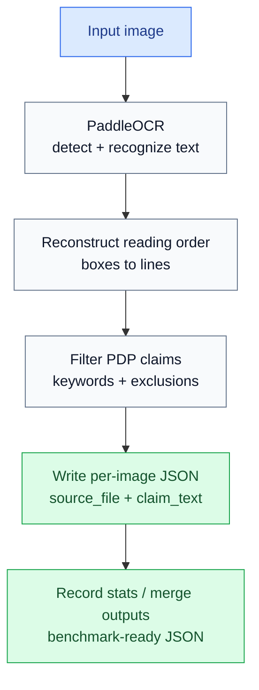

# PaddleOCR PDP Claim Extraction

This folder contains a local PaddleOCR pipeline for extracting Product Detail Page
(PDP) claims from cosmetics poster images.

The script does two jobs:

1. Run PaddleOCR text detection and recognition.
2. Apply rule-based filtering to keep likely PDP claims and remove irrelevant text.

Output JSON format:

```json
{
  "source_file": "SkinCeuticals_image14.png",
  "claim_text": [
    "保护更多健康胶原",
    "全新添加0.2%甘草酸二钾"
  ]
}
```

## Usage

Run one image:

```bash
/Applications/anaconda3/envs/py38/bin/python paddleOCR.py \
  --image "/path/to/image.png" \
  --output "/path/to/output.json" \
  --stats "/path/to/bench_stats.jsonl"
```

Run the batch script in the background:

```bash
nohup bash runPaddle_bench.sh > /private/tmp/paddle_bench.log 2>&1 &
```

Batch outputs are written to:

```text
PaddleOCR/output/json/
```

Runtime statistics are written to:

```text
PaddleOCR/output/bench_stats.jsonl
```

## Workflow



## Filtering Logic

The filtering logic is implemented in `paddleOCR.py` after PaddleOCR returns text
boxes. It is fully local and does not call an LLM.

### 1. OCR Box Filtering

Function:

```python
filter_boxes(...)
```

Each OCR text box is kept only if:

```text
text is not empty
confidence >= --min-confidence
box_height / image_height >= --min-height-ratio
```

Default thresholds:

```text
--min-confidence 0.50
--min-height-ratio 0.008
```

Purpose:

```text
Remove low-confidence OCR results and many tiny texts such as footnotes,
decorative text, or small bottle/package text.
```

If too many valid claims are missing, lower `--min-confidence` or
`--min-height-ratio`.

If too many tiny unrelated texts are included, raise `--min-height-ratio`.

### 2. Reading Order Reconstruction

Functions:

```python
group_into_lines(...)
render_line(...)
```

The script groups OCR boxes into visual lines by comparing vertical overlap and
center-y distance. Boxes in the same line are sorted left to right.

When two boxes in the same line have a large horizontal gap, a space is inserted.

Purpose:

```text
Recover poster reading order before PDP claim filtering.
```

### 3. PDP Claim Inclusion Rules

Function:

```python
is_pdp_claim(...)
```

A line is treated as a PDP claim if it matches `CLAIM_PATTERN`.

The current inclusion pattern keeps lines containing terms related to:

```text
Core effects:
淡化, 改善, 修护, 修复, 保湿, 补水, 紧致, 抗皱, 抗老, 抗氧,
抗醣, 抗糖, 提亮, 美白, 焕亮, 舒缓, 控油, 祛痘, 减少, 降低,
提升, 增强, 保护, 促进

Skin concerns and outcomes:
细纹, 皱纹, 毛孔, 弹性, 屏障, 损伤, 胶原, 饱满, 光泽, 透亮,
柔嫩, 平滑, 净澈, 匀净

Ingredients and formula:
添加, 蕴含, 富含, 配方, 成分, 玻尿酸, 透明质酸, 烟酰胺, 甘草酸,
维生素, 视黄醇, 胜肽, 神经酰胺, 水杨酸, 果酸, 精华

Evidence and tests:
测试, 实验, 实证, 验证, 认证, 临床, 真人, 消费者, 使用前, 使用后

Visual evidence descriptions:
区域, 荧光, 基底膜, 真表皮

Skin type or sensory feel:
肤质, 肌肤, 皮肤, 清爽, 滋润, 不黏腻

Numeric claims:
percentages, multiples, hours, days, weeks, months
```

Examples likely to be kept:

```text
全新添加0.2%甘草酸二钾
保护更多健康胶原
2周改善法令纹
72H锁水保湿
敏感肌适用
```

### 4. Exclusion Rules

Before checking PDP claim keywords, the script removes lines matching
`EXCLUDED_PATTERN`.

Current exclusions:

```text
Price-like text:
¥199, ￥299

Long numeric strings:
1234567890123

Specifications:
50ml, 30g, 100克, 200毫升

Package or compliance terms:
条形码, 净含量, 规格, 生产许可证, 执行标准, 保质期
```

### 5. Brand / Logo Exclusion

Exact brand/logo lines are excluded through the `--brand` argument.

Defaults:

```text
SkinCeuticals
修丽可
```

You can add more brand names:

```bash
/Applications/anaconda3/envs/py38/bin/python paddleOCR.py \
  --image "/path/to/image.png" \
  --output "/path/to/output.json" \
  --brand "兰蔻" \
  --brand "LANCOME"
```

Important: brand exclusion is exact-match only after whitespace is removed. It
does not remove a whole line if the line contains both a brand name and a valid
claim.

### 6. `--all-text`

By default, the script outputs only filtered PDP claims.

Use `--all-text` to skip PDP claim filtering and output all OCR lines that pass
the confidence and size filters:

```bash
/Applications/anaconda3/envs/py38/bin/python paddleOCR.py \
  --image "/path/to/image.png" \
  --output "/path/to/all_text.json" \
  --all-text
```

This is useful when debugging missed claims.

## Runtime Stats

If `--stats` is provided, one JSONL record is appended per image.

Fields:

```text
timestamp
image
output
ocr_version
lang
all_text
wall_seconds
cpu_user_seconds
cpu_sys_seconds
cpu_total_seconds
cpu_percent_estimate
max_rss_mb
line_count
```

Notes:

```text
wall_seconds: real elapsed time.
cpu_total_seconds: user CPU time plus system CPU time.
cpu_percent_estimate: cpu_total_seconds / wall_seconds * 100.
max_rss_mb: peak resident memory in MB.
line_count: number of output claim_text lines.
```

## Current Limitations

This is a rule-based filter, not semantic understanding.

Known limitations:

```text
1. OCR recognition errors may cause missed or incorrect claims.
2. A line containing a PDP keyword may be kept even if it is only weakly related.
3. A valid claim without any configured keyword may be missed.
4. Tiny but important claims may be removed by --min-height-ratio.
5. Brand exclusion only handles exact brand/logo lines.
```

For better recall, inspect output with `--all-text` and add missing PDP keywords
to `CLAIM_PATTERN`.

For better precision, add noise patterns to `EXCLUDED_PATTERN` or raise
`--min-height-ratio`.
