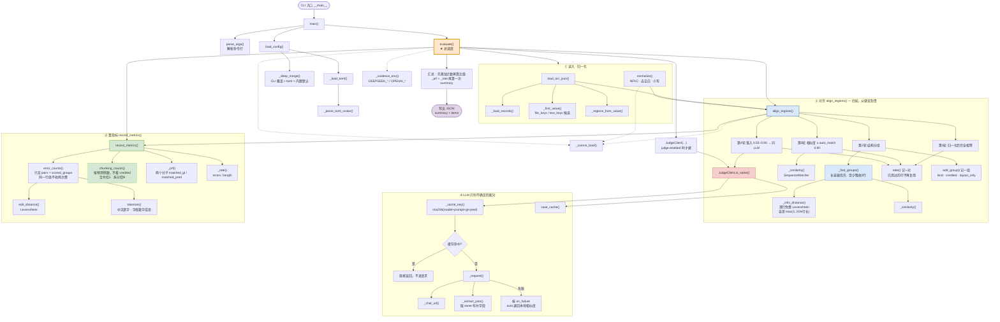

# OCR Benchmark README

`eval_ocr_with_llm.py` —— 评估 PDP OCR 结果。本地先做字符串比对，只有真正拿不准的配对才送 LLM 判断。

报**两个互相独立的维度**，对应 Target Outcomes 里的前两项：

| 维度 | 问题 | 指标 |
|---|---|---|
| **OCR Accuracy** | 字有没有全提出来、有没有提错 | CER、WER、Precision、Recall、F1 |
| **Chunking Accuracy** | 有没有按业务规则切成一条条 claim（拆开罚得比合并重） | `chunking_accuracy` |

这两件事必须分开看，因为**一个可以满分、另一个同时零分**。实测里就有这种图：

```text
Lancome_Cream_image13.png
  GT   : ['传奇柔缎质地', '法式高定调香', '愉悦柔润即刻奢养']
  PRED : ['传奇柔缎质地 法式高定调香 愉悦柔润 即刻奢养']

  OCR      cer 0.00  recall 1.00   字一个没错、一个没漏
  Chunking 0.00                    该切 3 条却并成 1 条
```

只看 CER 会以为这张图完美。只看 chunking 会以为模型没认出字。两个一起看才知道：识别没问题，**要修的是切分**。

## 评估流程

```text
1. 归一化      两边所有文字区域统一成可比较的形式
2. 对齐        顺序无关。精确匹配 → 结构分组 → 高相似度 → 不确定的交给 LLM
3. 算指标      OCR 指标从对齐结果算；chunking 指标从分组结果算
```

### 第 1 步：归一化

每条文字区域按 `[normalize]` 处理，之后所有比较和指标都基于归一化后的形式：

| 配置 | 默认 | 作用 |
|---|---|---|
| `unicode_nfkc` | true | NFKC 归一化，全角转半角，`（5）` == `(5)` |
| `ignore_whitespace` | true | 删除所有空白 |
| `case_sensitive` | false | 转小写 |
| `strip_punctuation` | false | 删除标点（默认关闭） |

### 第 2 步：对齐

对每张图，把标注的 N 个区域和预测的 M 个区域对上。**list 内部顺序不影响结果**——匹配按相似度贪心，不按位置。

相似度 = `difflib.SequenceMatcher(None, gt, pred).ratio()`，范围 `[0, 1]`。

四轮，从便宜到贵：

```text
第 1 轮  归一化后完全相等              → 匹配，不调 API
第 2 轮  结构分组：合并、拆分            → 见下，不调 API
第 3 轮  相似度 >= auto_match (0.90)   → 匹配，不调 API
第 4 轮  0.55 <= 相似度 < 0.90         → 调 LLM 判断
         相似度 <  reject_below (0.55) → 不算候选，不调 API
```

第 3、4 轮按相似度降序处理，分数相同时按索引升序，所以结果不依赖输入顺序。已配对的区域不会被再次使用。

分组必须排在相似度之前。否则一对一会把合并后的那条预测配给分数最高的单行，剩下几行全算漏检 —— 那是在惩罚合并本来没做错的事。

对齐结束后：

- `pairs` = 一对一配上的
- `groups` = 识别出的合并/拆分组
- `missing` = 标注里没配上的区域（漏检）
- `extra` = 预测里没配上的区域（多检）

### 第 2.5 步：粒度错误归 chunking，不归 CER

合并和拆开都是切分错误，方向相反，但**都不该由 CER 来收费**。

**合并** = 几条标注挤进一条预测。字一个没少，只是没切开，绝大多数是空格连接。**算命中**，只按编辑距离收费 —— 纯空格连接时拼接后完全相同，收费为零。

**拆开** = 一条标注碎成几条预测。同样**算命中**，把碎片按顺序拼起来跟标注比编辑距离。字读对了就是读对了，切错了由 chunking accuracy 单独扣，而且是每个碎片扣一次（见下）。

两个维度各管一件事，互不代劳。如果 CER 也惩罚拆开，一条字字正确、只是切成两半的预测会得到 `cer 2.00`，等于说"一个字都没读对"，这不是事实。

```text
标注 ['连续三年销量第一', '72H锁水保湿']  预测 ['连续三年销量第一 72H锁水保湿']
  → 合并，cer 0.00  recall 1.00  chunking 0.00   字全在，CER 不扣；切分错误由 chunking 记账

标注 ['连续三年销量第一']  预测 ['连续三年', '销量第一']
  → 拆开，cer 0.00  recall 1.00  chunking 0.00   同上，但 chunking 扣 2 个坏 chunk
```

怎么识别的：纯字符串包含判断，不花 API 调用。哪些标注行出现在同一条预测里，就是一个合并组；反之是拆分组。

严格子串一碰到错字就失效，所以用了近似包含（首行免费的 Levenshtein，`_infix_distance`），容差 `max(3, 25% 行长)`。那个绝对下限 3 有依据：丢一个上标括号的代价近乎恒定 3-4 字，纯比例会让长行通过、短行卡住。

```text
标注 ['72H（2）锁水保湿', '深层补水效果好']   预测 ['72h锁水保湿 深层补水效果好']
  严格子串 → 不成组（漏了「（2）」就不是子串），cer 1.82  ← 过度惩罚
  近似包含 → 成组，cer 0.18                            ← 只为真正丢掉的 3 个字收费
```

（成组至少要吸收 2 条标注行，所以上面第二行标注是必要的；1 对 1 的情况走相似度那一轮。）

`group_similarity = 0.85` 防止吞掉无关短串：碎片拼起来必须还原出整条，所以长句里孤立的一个 `SK-II` 会被拒绝而不是被吸收。

实测 `group_tolerance` 在 0.15–0.34 区间结果完全一致，默认 0.25 不在临界点上。

四种口径实测（GLM 31 张图，关 judge，13 个合并 / 10 个拆分）：

| 口径 | CER | Precision | Recall | F1 | chunking |
|---|---|---|---|---|---|
| 默认（合并、拆分都给分） | 1.3978 | 0.442 | 0.726 | 0.5496 | 0.5981 |
| `--no-split-credit` | 1.6389 | 0.318 | 0.662 | 0.4299 | 0.5981 |
| `--no-merge-credit` | 1.6801 | 0.388 | 0.471 | 0.4259 | 0.5981 |
| `--no-merge-credit --no-split-credit` | 1.9213 | 0.265 | 0.408 | 0.3208 | 0.5981 |
| `--group-similarity 1.1`（关掉分组） | 1.9094 | 0.269 | 0.414 | 0.3258 | 1.0000 |

前四行 chunking 完全一样：CER 给不给分不改变「切错了几行」这个事实。两个 `--no-*-credit` 是**双倍收费开关**，默认关闭；打开就是让 CER 再罚一遍 chunking 已经罚过的东西。最后一行的 1.0000 是**假象**——分组关掉后 13 个合并和 10 个拆分根本没被检测出来，`chunks_located` 从 107 掉到 65，指标看不见它没找的东西。要比较切分质量，别动 `group_similarity`。

### 第 3 步：LLM 只判断不确定的配对

落在 `[0.55, 0.90)` 区间的配对才发请求。给 LLM 的问题很窄：**这两段文字是不是同一处文字区域**，只回 `{"same": true/false}`。

一致性靠三点：

1. `temperature = 0`，并发送 `seed`（provider 支持时生效）。
2. **每个配对一个独立请求**，prompt 里不含其他记录的内容，所以判断不受同一张图其他区域影响。
3. 结果按 `sha256(model + prompt + 标注文本 + 预测文本)` 缓存到 `cache_file`。同一个配对无论出现在哪张图、哪次运行，都拿到同一个判断。

请求失败时按 `on_failure` 处理：

| 值 | 行为 |
|---|---|
| `auto`（默认） | 退回本地相似度判断，继续跑 |
| `reject` | 判为不匹配 |
| `error` | 抛异常中断 |

## 代码结构：函数之间的流动关系

下图按 AST 调用图生成，和代码一一对应。



几条从图上看不出、但值得单独说的：

**`evaluate()` 是唯一的总调度。** `main()` 只做三件事：解析参数、加载配置、调 `evaluate()`。所有按图循环的逻辑都在 `evaluate()` 里。

**只有红色那一支花钱。** `JudgeClient` 是唯一发网络请求的地方，且被 `[0.55, 0.90)` 区间夹住。分组是纯确定性计算，一次 API 都不调。

**分组必须排在相似度之前**（图上 R2 在 R3 前）。反过来的话，一对一会把合并后的那条预测配给分数最高的单行，其余行全算漏检——那是在惩罚合并本没做错的事。

**两条指标路径故意分岔。** `error_counts()` 只遍历 `pairs + scored_groups`，所以没记分的组不会被重复收费；`chunking_counts()` 遍历全部 `groups` 且无视 `credited`。这就是两个维度能互相独立的实现基础。

## 指标计算方法

### CER — Character Error Rate

字符错误率。**不是**把整张图的文字拼成一整串再比，而是在对齐结果上逐对累加：

```text
对每个匹配对：       errors += levenshtein(gt_norm, pred_norm)
                     length += len(gt_norm)

对每个记分组：       errors += levenshtein(拼接后的 gt, 拼接后的 pred)
（credited group）   length += len(拼接后的 gt)

对每个 missing：     errors += len(gt_norm)      # 全部算删除
                     length += len(gt_norm)

对每个 extra：       errors += len(pred_norm)    # 全部算插入，不计入 length

CER = errors / length
```

**记分组只走这一条路**：拿到记分的合并/拆分组按拼接串算一次编辑距离，纯空格拼接的合并因此得 0 错误。没拿到记分的组（默认所有拆分）不进这一步，它的行已经落在 `missing` / `extra` 里，按全删全插算——同一行绝不会被收两次费。

Levenshtein 距离 = 插入 + 删除 + 替换的最小次数。

`length == 0` 时（标注为空）：预测也为空则 CER = 0，否则 = 1。

**CER 可以大于 1**：预测多出的内容算插入，但分母只有标注长度。预测比标注长很多时就会超过 1，这是标准定义下的正常现象。

### WER — Word Error Rate

和 CER 完全一样的公式，只是把字符换成 token：

```text
WER = token_errors / token_length
```

中文没有空格，按空格切会让一整段变成一个 token，WER 就只会是 0 或 1。所以分词规则是：

| 规则 | 例子 |
|---|---|
| 连续字母算一个 token | `NO` → `["NO"]` |
| 连续数字（含 `.` `,` `%`）算一个 token | `40,000,000` → `["40,000,000"]` |
| 其他每个字符各算一个 token | `保湿霜` → `["保","湿","霜"]` |

正则：`[a-zA-Z]+|[0-9][0-9.,%]*|[^\sa-zA-Z0-9]`

例：`累计40,000,000+件热销` → `["累","计","40,000,000","+","件","热","销"]`

### Precision / Recall / F1

区域级别，基于对齐结果。分子有两个，因为一个记分组两边的行数不一样：

```text
matched_gt   = 配对数 + 所有记分组里的标注行数
matched_pred = 配对数 + 所有记分组里的预测行数

Precision = matched_pred / 预测区域总数
Recall    = matched_gt   / 标注区域总数
F1        = 2PR / (P + R)
```

3 个标注行合并进 1 个预测行、并且拿到记分，这算 3 个标注行被覆盖到（recall 3）、1 个预测行有出处（precision 1）。用单一分子会让两边至少有一边算错。

- Precision 低 → 预测出很多标注里没有的内容（切得太碎、抓了正文小字）
- Recall 低 → 漏掉了标注里的内容

分母为 0 时该项记为 1.0（约定），`P + R == 0` 时 F1 = 0。所以单条记录会出现这种组合：

| 标注 | 预测 | Precision | Recall | F1 |
|---|---|---|---|---|
| 空 | 空 | 1.0 | 1.0 | 1.0 |
| 空 | 非空 | 0.0 | 1.0 | 0.0 |
| 非空 | 空 | 1.0 | 0.0 | 0.0 |

这只影响 `items` 里的单条数字，`summary` 是按计数汇总的，不受这个约定影响。

### Chunking Accuracy

上面那几个指标衡量的是"字读对了没有"，这一个衡量的是"行切对了没有"。两件事必须分开报，因为它们会朝相反方向走。

**按预测侧数**：模型输出的 chunk 里，有多少是切对的 chunk。

| 状态 | 含义 | 进分母 |
|---|---|---|
| whole | 一对一配上了，边界正确 | 1 个好 chunk |
| merged | 几条标注挤进同一个预测行 | **1** 个坏 chunk（不管吞了几行） |
| split | 一条标注碎成 N 个预测行 | **N** 个坏 chunk（每个碎片都算） |

```text
chunk_located = chunk_whole + chunk_merged + chunk_split
chunking_accuracy = chunk_whole / chunk_located
```

**合并和拆分的权重是不对称的，这是刻意的。** 10 行并成 1 行只扣 1，1 行拆成 4 行扣 4 —— 合并只是少了个边界，字全在、语义没变；拆分产出的每个碎片都是半句 claim，下游不能用。按标注侧数会正好反过来（合并扣 10、拆分扣 1），所以这里数预测侧。这个不对称靠结构自带，没有引入权重参数。

```text
标注 5 行 → 预测 3 行（3 并 1，其余对）   chunking 0.6667
标注 5 行 → 预测 5 行（1 拆 3，其余对）   chunking 0.4000
```

同样规模的粒度错误，拆分掉得多得多。

其余三条设计决定：

**分母排除没被定位到的行。** 一行完全没被读出来（`missing`）是 OCR 失败，不是切分失败，CER 和 recall 已经罚过了。把它算进这里只会让两个数字同步升降，就失去了分开报的意义。分母是 0（一行都没定位到）时记 0.0。

**合并在这里仍然算错（只是扣得轻），即使 CER 完全放过了它。** 这正是这个指标存在的理由。`Lancome_Cream_image13.png`：标注 3 行，预测把它们用空格拼成 1 行。

```text
CER              0.00     一个字都没错
Recall           1.00     内容全都在
chunking_accuracy 0.00    3 行按业务规则应该是 3 个 claim，模型给了 1 个
```

反过来也成立：一行被完整读出但错了好几个字，chunking 是满分，CER 很难看。两个数字互不遮蔽。

**记分与否不影响这个指标。** `chunk_merged` / `chunk_split` 数的是 `groups` 里所有的组，不管 `credited` 是 true 还是 false。`merge_credit` / `split_credit` 调的是「要不要在 CER 上放过它」，chunking accuracy 永远照实报。所以切换那两个开关时 chunking accuracy 不动，这是有意的（实测四种口径都是 0.5981）。这也正是默认两个都给分的理由：粒度错误在这里已经记了账，CER 再记一遍就是双倍收费。

不过 `group_similarity` 会影响它，而且方向反直觉：把门槛提到 1.1 等于关掉分组，13 个合并和 10 个拆分不再被检测，`chunks_located` 从 107 掉到 65，chunking accuracy 反而变成 1.0。指标只能报它检测到的东西，比较切分质量时不要动这个门槛。

实测（GLM，31 张图）：

```text
chunks_whole   64
chunks_merged  13        13 个合并组，每组只扣 1
chunks_split   30        10 个拆分组，共碎出 30 个预测行
chunks_located 107       64 + 13 + 30
chunking_accuracy 0.5981 64 / 107
```

注意 `merges`(13) 和 `chunks_merged`(13) 相等是因为每个合并组固定扣 1；`splits`(10) 和 `chunks_split`(30) 不等，差的就是碎片数。

同一批数据 CER 1.3978、F1 0.550。读字的问题和切行的问题各自独立：CER 那 1.40 里已经不含任何粒度惩罚，全是真的读错和多吐（主要是重复退化和脚注符号）；chunking 那 0.5981 全是切分问题，**主要来自拆分**（30 个坏 chunk vs 合并 13 个），也就是把一条完整 claim 切成了几段。

一个已知的边界情况：落在 uncertain 区间又没开 judge 的对子两边都不配对，它既不进 `chunk_whole` 也不进 `chunk_merged`，直接离开分母。开 judge 后这些行会被裁决，分母会变大。

### 汇总口径

`summary` 里的数字是**先累加计数再算比值**，不是把每张图的比值取平均：

```text
summary.cer = sum(所有图的 char_errors) / sum(所有图的 char_length)
```

这样长图不会被低估权重。逐张图的比值在 `items` 里。

## 扣分标准速查

两套标准，各管一件事，互不干扰。下面每个数字都是 GLM 31 张图的实测输出。

### CER / Precision / Recall / F1 —— 字读对了没有

| 情况 | 怎么扣 | 实测 |
|---|---|---|
| 一对一配上 | 按这一对的编辑距离 | 一个错字 → cer 0.042 |
| **合并**（几行并一行） | **按拼接串算一次**，空格拼接 = 零错 | cer **0.000** |
| 合并但丢了字 | 只为真正丢的字收费 | 丢 2 字 / 25 字 → cer 0.080 |
| **拆分**（一行碎成几行） | **按碎片拼接串算一次**，切干净了 = 零错 | cer **0.000** |
| 漏检 | 整行算删除 | cer 0.458 |
| 误检 | 整行算插入，**且不进分母** | cer 0.846 |

合并和拆分在 CER 上是同一个待遇：把该在一起的字拼起来，只为真正读错的字收费。切分本身的错由 chunking accuracy 记账，CER 不重复收费。带 `--no-merge-credit` / `--no-split-credit` 可以打开双倍收费（标注全算漏检 + 碎片全算误检，一个 24 字的干净拆分会得到 cer 2.000），默认关闭。

### Chunking Accuracy —— 行切对了没有

| 情况 | 进分母 |
|---|---|
| 一对一配上 | 1 个好 chunk |
| **合并** | **1** 个坏 chunk，吞 2 行还是 10 行都一样 |
| **拆分** | **N** 个坏 chunk，碎几片扣几个 |
| 漏检 | **不进分母**（那是 OCR 失败，CER 已经罚过） |

同样「5-6 个标注行、一个粒度错误、其余全对」的对照，合并吞的行数增加时扣分不变，拆分的碎片数增加时扣分线性上升：

```text
合并 2 行 → 1 行     chunking 0.7500   坏 chunk 1
合并 3 行 → 1 行     chunking 0.6667   坏 chunk 1
拆 1 行 → 2 行       chunking 0.6000   坏 chunk 2
拆 1 行 → 3 行       chunking 0.4000   坏 chunk 3
```

### 一句话总结

**CER 只管字**：合并和拆分都按拼接串收费，字读对了就是零错。
**Chunking 只管刀**：合并不管吞几行都只扣 1 个 chunk，拆分碎几片扣几个。所以拆分依然比合并重罚，只是这个不对称只体现在 chunking 上，不再让 CER 代罚一遍。

## 实例：真实数据上的扣分过程

以下全部来自 GLM 31 张图（`--debug` 输出），不是构造的例子。

### 合并 1：纯排版，两个指标都几乎不罚

```text
[Clarins_image08.png]  3 行 → 1 行
  GT    +46% 皱纹增加
  GT    +13% 肤色暗沉
  GT    +30% 肌肤松垮
  PRED  +46% 皱纹增加 +13% 肤色暗沉 +30% 肌肤松垮

  CER      0.00   拼接后一个字不差（layout_only = true）
  chunking 扣 1 个坏 chunk
```

### 合并 2：吞了 10 行，扣分不增加

```text
[Comfy_image05.png]  10 行 → 1 行，错 18 字 / 85 字
  GT    强修护 / 筑屏障 / 高保湿 / 实证更安全 / 55项（9）过敏原筛查 ...共10行
  PRED  实证更安全 55项（9）过敏原筛查 42项（10）无传统防腐剂 温和不刺激（11）...

  chunking 扣 1 个坏 chunk，不是 10 个   ← 「合并不按行数罚」就体现在这里
```

### 合并 3：有识别错，只为真正丢的字收费

```text
[Comfy_image05.png]  3 行 → 1 行，错 2 字 / 32 字，局部 cer 0.062
  GT    可复美胶原棒2.0（11）
  GT    全皮层胶原强修护（13）
  GT    修红快·准·稳
  PRED  可复美胶原棒2.0（1） 全皮层胶原强修护（3）修红快·准·稳
                       ↑ 脚注 11→1、13→3，只罚这 2 个字
```

### 拆分 1：CER 只罚真的错字，chunking 罚刀数

```text
[SkinCeuticals_image13.png]  1 行 → 5 行   similarity 0.8600  credited = true
  GT    全新A.G.E.面霜（1）：8天-75%（6）胶原醣化流失 全链抑制胶原醣化 保护胶原不流失
  PRED  全新A.G.E.面霜（1）
  PRED  8天-75%（6）胶原醣化流失
  PRED  -75%（6）胶原醣化损伤       ← 这一行是多吐的，「流失」还错成「损伤」
  PRED  全链抑制胶原醣化
  PRED  保护胶原不流失

  CER      char_errors 14 / gt_chars 44        只为真正错的 14 个字收费
  chunking 扣 5 个坏 chunk → 0.1667
```

这一组的 14 个错字不是切分造成的，是那条多出来的 `-75%（6）胶原醣化损伤`。把 5 个碎片拼起来跟标注比，多出的内容和错字才进 CER。切成 5 段这件事只在 chunking 上扣。整张图：`cer 0.6627  f1 0.7059  chunking 0.1667`。

### 拆分 2：切得很干净，CER 就该接近零

```text
[Mistine_Sunscreen_image21.png]  1 行 → 4 行   similarity 0.9204  credited = true
  GT    SGS 28天消费者真人实测：紧致改善+20.47%（40），弹性改善+23.59%（40），皱纹改善-20.24%（40）
  PRED  SGS 28天消费者真人实测
  PRED  紧致改善 +20.47% 40
  PRED  弹性改善 +23.59% 40
  PRED  皱纹改善 -20.24% 40

  CER      char_errors 9 / gt_chars 61 = 0.148   丢的是 3 组括号
  chunking 扣 4 个坏 chunk → 0.2000
```

数字全对，只丢了括号，所以 CER 上只收 9 个字的钱。旧版本这里 `credited = false`，会报 `cer 2.000` —— 等于宣称一个字都没读对，而实际上 61 个字里读错 9 个。切成 4 段的问题一直都在 chunking 的 0.2000 里，不需要 CER 再说一遍。整张图从 `cer 1.4658 / f1 0.182` 变成 `cer 0.7534 / f1 0.5882`，chunking 不变。

### 为什么两个指标必须都看

**A. CER 满分、chunking 零分**

```text
[SKII_Skinpower_Cream_image08.png]  cer 0.00  recall 1.00  chunking 0.000
  GT    苹果肌高光点 提升>5毫米（5）
  GT    高光点指肌肤状态拟合点的创意描述
  PRED  苹果肌 高光点 提升 >5 毫米（5） 高光点指肌肤状态拟合点的创意描述

  只看 CER 会以为这张图完美，实际该给 2 条 claim 却给了 1 条
```

**B. chunking 满分、CER 12.11**

```text
[PROYA_Ruby_image23.png]  cer 12.11  precision 0.50  chunking 1.000
  唯一的配对：错 0 字 / 27 字，切分完全正确
  但多出一条 488 字的重复垃圾：
  PRED  PROYA 嫩化 嫩化 嫩化 嫩化 嫩化 嫩化 嫩化 ...（重复到 488 字）

  CER = (0 + 归一化后 327) / 27 = 12.11    误检算插入，但不进分母
```

B 暴露一个**真实缺口**，值得单独记住：那条 488 字的重复垃圾对 chunking accuracy 毫无影响（仍是 1.000），因为它不属于任何 group，只是个 `extra`。**chunking accuracy 不惩罚这类幻觉/重复垃圾**，它只衡量「被定位到的内容切得对不对」。这类问题由 CER 和 precision 抓（这张图 precision 0.50）。

所以判断一个模型至少要三个数一起看：

| 看什么 | 抓什么问题 |
|---|---|
| CER / WER | 识别错、重复退化 |
| Precision | 垃圾输出、幻觉、抓了正文小字 |
| Chunking Accuracy | 切分错（尤其是拆开） |

GLM 这批数据上三个都有问题，但主因不同：重复退化拉爆 CER，拆分拉低 chunking。

## Usage

只跑本地指标，不调 API：

```bash
python benchmark/eval_ocr_with_llm.py \
  --ground-truth Datasets/pdp_claims_chunked_no_footnotes.json \
  --prediction PaddleOCR/output/merged_paddleOCR.json \
  --output benchmark/eval_result.json \
  --config benchmark/config.toml \
  --no-llm-judge
```

打开 LLM judge：

```bash
export DEEPSEEK_API_KEY="sk-..."
export DEEPSEEK_BASE_URL="https://api.deepseek.com"
export DEEPSEEK_MODEL="deepseek-chat"

python benchmark/eval_ocr_with_llm.py \
  --ground-truth Datasets/pdp_claims_chunked_no_footnotes.json \
  --prediction PaddleOCR/output/merged_paddleOCR.json \
  --output benchmark/eval_result.json \
  --llm-judge
```

`OPENAI_API_KEY` / `OPENAI_BASE_URL` / `EVAL_MODEL` 也认。

### 命令行参数

| 参数 | 说明 |
|---|---|
| `--ground-truth` | 标注 JSON（必填） |
| `--prediction` | 预测 JSON（必填） |
| `--output` | 输出路径，默认 `outputs/ocr_eval.json` |
| `--config` | 配置文件，默认 `benchmark/config.toml`，不存在则用内置默认 |
| `--llm-judge` / `--no-llm-judge` | 强制开 / 关 judge |
| `--detail` | 每条记录附上 `missing` / `extra` 列表 |
| `--debug` | 每条记录附上完整配对过程和相似度打分，见下文 |
| `--no-merge-credit` | 让 CER 把合并再罚一遍（标注算漏检 + 预测算误检） |
| `--no-split-credit` | 让 CER 把拆分再罚一遍，同上 |
| `--group-similarity` | 覆盖成组门槛，设 >1 等于关掉整个分组 |
| `--no-cache` | 忽略缓存，全部重新判断 |
| `--verbose` | 打印每个送去判断的配对 |
| `--prompt-file` | 替换 judge prompt |
| `--api-key` / `--base-url` / `--model` | 覆盖环境变量 |

## Input Format

文件名字段按 `file_keys` 顺序取第一个存在的，文字字段按 `text_keys` 取。

**JSON 数组**：

```json
[
  {"source_file": "a.png", "claim_text": ["第一条", "第二条"]},
  {"source_file": "b.png", "claim_text": []}
]
```

**JSONL**（每行一个对象，自动识别，`benchmark/demo/` 里的文件就是这种）：

```text
{"source_file":"a.png","claim_text":["第一条","第二条"]}
{"source_file":"b.png","claim_text":[]}
```

也支持字符串形式（按换行切分）和 `{"items": [...]}` 包一层：

```json
[{"file_name": "a.png", "text": "第一条\n第二条"}]
```

空值可以写 `[]`、`""` 或 `<EMPTY>`（`empty_token`）。

**只评估预测文件里有的图。** 两边文件名取交集：预测里有但标注里没有的图被忽略；标注里有但预测里没有的图**不打分、不进任何分子分母**，只在 stdout 打一行 `[coverage]` 提示，并计入 `summary.unpredicted_files`。这样跑局部数据不会被大量「未预测」的图拉低分数。

```text
[coverage] 1 ground-truth file(s) absent from predictions, not scored: gt_only.png
```

一个边界情况：预测里那一行**存在但内容是空列表**，仍然照常评估（模型确实跑了、确实什么都没返回），Recall 记 0。也就是说「只评估预测里有的」判断的是那条记录在不在，而不是它非不非空。

## Output Structure

```json
{
  "summary": {
    "count": 31,
    "cer": 1.3978,
    "wer": 1.1811,
    "precision": 0.4421,
    "recall": 0.7261,
    "f1": 0.5496,

    "chunking_accuracy": 0.5981,
    "chunks_located": 107,
    "chunks_whole": 64,
    "chunks_merged": 13,
    "chunks_split": 30,

    "gt_regions": 157,
    "pred_regions": 242,
    "matched_gt_regions": 114,
    "matched_pred_regions": 107,

    "merges": 13,
    "merges_layout_only": 5,
    "splits": 10,
    "credited_groups": 23,
    "penalized_groups": 0,
    "merge_credit": true,
    "split_credit": true,

    "gt_files": 31,
    "scored_files": 31,
    "unpredicted_files": 0,

    "uncertain_pairs_skipped": 23
  },
  "items": [
    {
      "source_file": "ForestCabin_Camellia_image18.png",
      "cer": 0.0,
      "wer": 0.0,
      "precision": 1.0,
      "recall": 1.0,
      "f1": 1.0,
      "chunking_accuracy": 1.0,
      "merges": 0,
      "splits": 0
    }
  ]
}
```

上面是 GLM 31 张图关掉 judge 的真实输出。开 judge 时最后一项换成 `judge_calls` / `judge_cache_hits` / `judge_failures`。

三组数字分别回答三个问题：

| 字段组 | 回答 |
|---|---|
| `cer` / `wer` / `precision` / `recall` / `f1` | 字读对了没有 |
| `chunking_*` / `merges` / `splits` | 行切对了没有 |
| `gt_files` / `scored_files` / `unpredicted_files` | 这次跑覆盖了多少数据 |

`matched_gt_regions` 和 `matched_pred_regions` 通常不相等，差值就是合并/拆分吃掉的行数。

`merges_layout_only` 数的是纯排版差异的合并——拼起来一个字都不差，只是空格连接。这个数越接近 `merges`，说明模型的问题纯粹是切分而不是识别。

`unpredicted_files` 是标注里有、预测文件里完全没提到的图，不进任何分子分母。用全量标注去测一个只跑了几十张的预测文件时这个数会很大，属于正常，`scored_files` 才是分数真正的样本量。

关闭 judge 时，`summary` 里换成 `uncertain_pairs_skipped`，表示有多少配对因为没有 judge 而没被判断（这些都算作 missing + extra，所以关掉 judge 的分数是下界）。

加 `--detail` 后每条 item 多出：

```json
"missing": ["标注里漏掉的区域"],
"extra":   ["预测里多出的区域"]
```

### `--debug`：完整配对过程

加 `--debug`（或 config 里 `[output] debug = true`）后，每条 item 多一个 `debug` 字段，记录这张图**所有配对决策和 SequenceMatcher 打分**。`--debug` 自动打开 `--detail`。

```json
"debug": {
  "thresholds": {
    "auto_match": 0.9,
    "reject_below": 0.55,
    "group_similarity": 0.85,
    "merge_credit": true,
    "split_credit": true
  },

  "groups": [
    {
      "kind": "merge",
      "gt": "骄阳日晒·过度清洁·换季敏感 | 晒后损伤 | 娇嫩肌、敏感肌危'肌'四伏",
      "pred": "骄阳日晒·过度清洁·换季敏感 娇嫩肌、敏感肌 危肌 四伏",
      "similarity": 0.8929,
      "credited": true,
      "layout_only": false,
      "gt_rows": 3,
      "pred_rows": 1,
      "char_errors": 6,
      "gt_chars": 31
    }
  ],

  "matched": [
    {
      "gt": "连续3年线上保湿霜销量NO.1（5）",
      "pred": "连续3年保湿霜销量NO.1",
      "similarity": 0.8387,
      "matched_by": "llm",
      "judge_source": "api",
      "char_errors": 5,
      "gt_chars": 18,
      "token_errors": 5,
      "gt_tokens": 17
    }
  ],

  "unmatched_gt": [
    {
      "gt": "妈妈网口碑榜",
      "best_similarity": 0.4211,
      "best_pred": "宝宝树金树奖"
    }
  ],

  "unmatched_pred": [
    {
      "pred": "intensemoisture for72hourshydration",
      "best_similarity": 0.1053,
      "best_gt": "累计40,000,000+件热销（6）"
    }
  ],

  "rejected": [
    {
      "gt": "宝宝树（7）金树奖 2021-2025年度连续5年蝉联宝宝树（7）金树奖",
      "pred": "2021-2025年度连续5年蝉联宝宝树7金树奖",
      "similarity": 0.8136,
      "decision": "llm_said_different",
      "judge_source": "api"
    }
  ]
}
```

字段含义：

| 字段 | 说明 |
|---|---|
| `groups` | 检测到的合并/拆分组。`gt` / `pred` 里的 ` \| ` 是多行的分隔显示，不是原文内容 |
| `kind` | `merge`（多条标注→一条预测）/ `split`（一条标注→多条预测） |
| `credited` | 是否在 CER 上给分。false 时它的行已落在 `missing` / `extra`，`char_errors` 不再计入 |
| `layout_only` | true = 拼接后一个字都不差，纯排版差异（空格连接） |
| `gt_rows` / `pred_rows` | 两边各占几行。`pred_rows` 就是这个组进 chunking 分母的数量：合并恒为 1，拆分是碎片数 |
| `matched` | 配上的对。`similarity` 是 SequenceMatcher 打分，`char_errors` / `token_errors` 是这一对贡献给 CER / WER 的分子，`gt_chars` / `gt_tokens` 是贡献的分母 |
| `matched_by` | `exact`（完全相等）/ `similarity`（≥ auto_match）/ `llm`（judge 判定） |
| `judge_source` | 只在 `matched_by = llm` 时出现。`api` = 真实请求，`cache` = 命中缓存，`fallback` = 请求失败退回本地判断 |
| `unmatched_gt` | 没配上的标注区域，附它在所有预测里的**最高分**和对应文本 |
| `unmatched_pred` | 没配上的预测区域，同上 |
| `rejected` | 进入过候选但最终没配上的对，按分数降序 |

`rejected` 里的 `decision`：

| 值 | 含义 |
|---|---|
| `llm_said_different` | judge 判为不是同一处文字 |
| `uncertain_no_judge` | 落在不确定区间，但 judge 关着，所以没判 |
| `lost_to_better_pair` | 分数够，但对面已经跟更高分的配掉了 |

相似度低于 `reject_below` 的对**不会**逐条列进 `rejected`——那是整个 N×M 笛卡尔积，会把文件撑爆。这些区域的最高分在 `unmatched_gt` / `unmatched_pred` 里能看到。

调 `debug` 不影响任何指标，只是多输出信息。体积取决于每张图的区域数，GLM 那批 10 张图约 26 KB。

典型用法——想知道为什么某个区域没配上：

```bash
python benchmark/eval_ocr_with_llm.py \
  --ground-truth benchmark/demo/PDP_groundTruth_0805_demo.json \
  --prediction benchmark/demo/pdp_claims_chunked_no_footnotes.demo.json \
  --output /tmp/dbg.json --debug --no-llm-judge

python -c "
import json
d = json.load(open('/tmp/dbg.json', encoding='utf-8'))
for r in d['items'][0]['debug']['unmatched_gt']:
    print(f\"{r['best_similarity']}  {r['gt']}  <>  {r['best_pred']}\")
"
```

分数集中在 0.80-0.89 就说明 `auto_match = 0.90` 卡太严，可以调低，或者打开 judge 让它判。

## 关于 `eval_ocr_global_llm.py`

曾经有一个全局对齐版本：把整张图的标注和预测清单一次性发给 LLM，让它自己给出全部对应关系（含拆分/合并）。**这个方向已经放弃**，脚本和它的文档都在 `benchmark/trash/`，不再维护，也不要用它出分。`benchmark/performance/` 和 `benchmark/log/` 下带 `global` 的旧结果同样不要引用。

放弃的原因是它把太多判断权交给了模型：一次调用要同时决定配对、拆分、合并和漏检，输出难以复现，返回值需要大量修补逻辑才敢用，出了问题也无法定位是哪一环错的。上面第 2/2.5 步的做法把这些决策拆开——分组由确定性的近似子串匹配算出来，LLM 只在一个很窄的相似度区间里回答单个是非问题。同样的能力，行为可预测得多。

拆分/合并的处理口径见「第 2.5 步」，切分质量的度量见「Chunking Accuracy」。

## Config Parameters

`config.toml` 四个段。`[align]` 段里两个脚本各读自己的键，互不干扰。

### `[input]`

| 键 | 默认 | 说明 |
|---|---|---|
| `file_keys` | `["source_file","file_name","image"]` | 文件名字段候选，按顺序取 |
| `text_keys` | `["claim_text","lines","text","prediction"]` | 文字字段候选 |
| `empty_token` | `"<EMPTY>"` | 表示无文字的标记 |

### `[normalize]`

见上文“第 1 步”。

### `[align]`

逐对版（`eval_ocr_with_llm.py`）读这两个：

| 键 | 默认 | 说明 |
|---|---|---|
| `auto_match` | 0.90 | 相似度 >= 此值直接判匹配，不调 API |
| `reject_below` | 0.55 | 相似度 < 此值直接判不匹配，不调 API |

两者之间的区间越宽，API 调用越多、越准也越慢。想省钱就把 `auto_match` 降到 0.85、`reject_below` 提到 0.65。

分组（合并/拆分）这一轮读下面五个：

| 键 | 默认 | 说明 |
|---|---|---|
| `merge_credit` | true | 多行合成一行仍算匹配，只按拼接串收编辑距离。false = CER 再罚一遍 |
| `split_credit` | true | 一行拆成多行仍算匹配，同上。false = CER 再罚一遍 |
| `group_similarity` | 0.85 | 拼接串要达到这个相似度才成组。设 >1 等于关掉分组 |
| `group_tolerance` | 0.25 | 单行容错，一两个错字仍能被吸收 |
| `min_group_part` | 2 | 比这更短的行不参与成组 |

两个都默认 true，因为粒度错误已经由 chunking accuracy 记账，CER 不该重复收费。把任一个设成 false，那类错误会被罚两次。它们只影响 CER 和 P/R/F1，**不影响 chunking accuracy**——那个指标照实数所有组。但 `group_similarity` 会影响它：门槛设得过高，组检测不出来，chunking accuracy 会虚高到 1.0。

`group_tolerance` 在 0.15–0.34 之间跑出来的结果完全一致，0.25 不在临界点上。它和一个 3 字符的绝对下限取大值：漏一个脚注标记（比如 `（2）`）的代价近似恒定 3–4 字符，纯比例会让短行永远进不了组。

### `[judge]`

| 键 | 默认 | 说明 |
|---|---|---|
| `enabled` | true | 是否调用 LLM |
| `cache_file` | `benchmark/.judge_cache.json` | 判断缓存，置空则不缓存 |
| `temperature` | 0 | 保持 0 |
| `seed` | 20260805 | provider 支持时生效 |
| `timeout` | 120 | 单次请求超时秒数 |
| `retries` | 3 | 重试次数，指数退避 |
| `response_format_json` | true | 发送 `response_format: json_object`；provider 不支持时改 false |
| `on_failure` | `"auto"` | 见上文失败处理 |

### `[output]`

| 键 | 默认 | 说明 |
|---|---|---|
| `detail` | false | true 时每条 item 附 `missing` / `extra` |
| `debug` | false | true 时每条 item 附完整配对过程和相似度打分 |

## 注意

**CER / WER 超过 1 是正常的**，预测比标注长时必然发生，见上文 CER 一节。

**合并和拆分不对称，这是有意的，别当成 bug。但不对称只在 chunking 上。** CER 侧两者同等对待：都按拼接串收费，只为真正读错的字扣分，纯空格拼接的合并 CER 为 0，切得干净的拆分也接近 0。Chunking 侧才分开——合并不管吞几行只扣 1 个 chunk，拆分每个碎片都扣。理由是合并只是少了个边界，字全在、语义没变；拆开的半句 claim 下游不能用。想让 CER 也罚粒度错误用 `--no-merge-credit` / `--no-split-credit`（不影响 chunking），但那等于同一个错误罚两遍，而且对比不同 OCR 时必须用同一套开关。

**Precision 和 Recall 的分子不同。** 3 条标注合并进 1 条预测并拿到记分时，命中的是 3 条标注和 1 条预测：Recall 按标注侧数、Precision 按预测侧数，所以 group 不会把任何一边刷高。这也是 summary 里 `matched_gt_regions` 和 `matched_pred_regions` 要分开报的原因。

**CER 好看不代表切分对。** 这两个维度会朝反方向走，必须一起看，见「Chunking Accuracy」。

**判错的 group 只扣一次分。** 它的标注进 `missing`、预测进 `extra`，编辑距离在这两处各算一遍，不会再作为 group 算第三遍。`error_counts()` 只遍历 `scored_groups` 就是为了这个。

**换了 prompt 或 model 缓存自动失效**（缓存 key 含两者），不用手动删。
