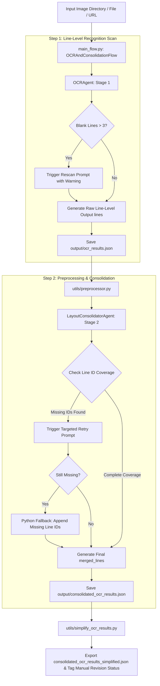

# OCRagent: Intelligent Document OCR & Layout-Aware Semantic Consolidation Framework

`OCRagent` is a two-stage agentic framework designed to resolve common challenges in traditional document OCR—such as line fragments, paragraph splitting, and text loss. Powered by **CrewAI Flow** and **Alibaba DashScope Qwen Multimodal LLMs** (via OpenAI SDK compatible interface), `OCRagent` extracts line-level text from document images and merges them based on spatial proximity and semantic continuity, guaranteeing **100% Zero-Omission Coverage** of extracted text lines.

---

## Table of Contents

- [Key Features](#key-features)
- [System Architecture & Flowchart](#system-architecture--flowchart)
- [Directory Structure](#directory-structure)
- [Detailed Script Analysis](#detailed-script-analysis)
  - [1. Flow Orchestration Entry (`main_flow.py`)](#1-flow-orchestration-entry-main_flowpy)
  - [2. Stage 1 Recognition Agent (`agent/OCR.py`)](#2-stage-1-recognition-agent-agentocrpy)
  - [3. Stage 2 Layout Consolidation Agent (`agent/Consolidator.py`)](#3-stage-2-layout-consolidation-agent-agentconsolidatorpy)
  - [4. Data Preprocessing Utility (`utils/preprocessor.py`)](#4-data-preprocessing-utility-utilspreprocessorpy)
  - [5. Log Parsing & Output Simplification (`utils/simplify_ocr_results.py`)](#5-log-parsing--output-simplification-utilssimplify_ocr_resultspy)
  - [6. Tests & Benchmarking Suite (`tests/`)](#6-tests--benchmarking-suite-tests)
- [Installation & Environment Setup](#installation--environment-setup)
- [Quick Start](#quick-start)
- [Data Schema Specifications](#data-schema-specifications)

---

## Key Features

1. **Two-Stage Agent Pipeline**:
   - **Stage 1 (Line-Level OCR Scan)**: Performs top-to-bottom, left-to-right extraction of visible line-level text from document images.
   - **Stage 2 (Layout & Semantic Consolidation)**: Fuses image spatial features with Stage 1 text items. Consolidates split lines into coherent sentences while preserving standalone headings, isolated labels, and table cells.
2. **Multi-Threaded Parallel Execution**: Built-in `ThreadPoolExecutor` (defaulting to 5 workers) enables high-throughput batch image processing.
3. **Smart Exception Handling & Automatic Retry**:
   - **Blank Line Detection**: Stage 1 detects excessive blank outputs (> 3 blank lines) and triggers a warning-injected prompt rescan.
   - **Missing Line ID Detection**: Stage 2 tracks all input `line_id`s. If any lines are dropped by the LLM, it automatically initiates a targeted re-processing prompt specifying missing line IDs.
4. **Python-Side Fallback Protection (Zero-Omission Guarantee)**:
   - If missing line IDs persist after LLM retry, the framework automatically appends unmerged lines on the Python side, guaranteeing **100% line coverage**.
5. **Status Tagging & Simplified Export**:
   - Automatically parses runtime logs, flags items triggering fallback protection with `(Manual Revision Needed)`, and exports a clean, simplified array format.

---

## System Architecture & Flowchart



---

## Directory Structure

```text
OCRagent/
├── agent/
│   ├── OCR.py                 # Stage 1: Multimodal line-level text extraction Agent
│   └── Consolidator.py        # Stage 2: Layout proximity & semantic consolidation Agent
├── utils/
│   ├── preprocessor.py        # Stage 1 -> Stage 2 data decoupling & payload builder
│   └── simplify_ocr_results.py# Log parsing, fallback status tagging & JSON simplification
├── tests/
│   ├── test_ocr_agent.py      # Unit test for OCRAgent (non-empty & sequential ID assertions)
│   ├── test_consolidator.py   # Unit test for Consolidator (100% zero-omission assertion)
│   ├── test_ocr_model_compare.py # Benchmark comparison: qwen3.5-ocr vs qwen-vl-max
│   └── test_prompt_ab.py      # A/B testing: Baseline prompt vs Strong-constraint prompt
├── main_flow.py               # CrewAI Flow main entry point
├── .env                       # Environment configuration (API Keys & Base URL)
└── README.md                  # Project documentation
```

---

## Detailed Script Analysis

### 1. Flow Orchestration Entry (`main_flow.py`)
- **Class**: `OCRAndConsolidationFlow(Flow[OCRFlowState])`
- **Functionality**:
  - Manages execution state via `OCRFlowState` (`image_inputs`, `output_dir`, `raw_ocr_results`, `consolidated_results`).
  - `@start() step1_ocr_scan`: Instantiates `OCRAgent(max_workers=5)`, runs parallel scanning, and writes results to `output/ocr_results.json`.
  - `@listen(step1_ocr_scan) step2_preprocess_and_consolidate`: Uses `prepare_consolidation_inputs` to decouple inputs, invokes `LayoutConsolidatorAgent` per image, and writes consolidated output to `output/consolidated_ocr_results.json`.

### 2. Stage 1 Recognition Agent (`agent/OCR.py`)
- **Class**: `OCRAgent`
- **Default Model**: `qwen-vl-max` (configurable to `qwen3.5-ocr`)
- **Key Methods**:
  - `_collect_image_files`: Resolves directory paths, single image files, URLs, or JSON path arrays.
  - `_process_single_image`: Calls DashScope API via OpenAI SDK to scan text top-to-bottom and left-to-right.
  - `_normalize_parsed_result`: Cleans output, filters empty strings, and re-indexes valid lines to sequential `line_id: 1..N`.
  - `run`: Uses `ThreadPoolExecutor` for multi-threaded batch execution.

### 3. Stage 2 Layout Consolidation Agent (`agent/Consolidator.py`)
- **Class**: `LayoutConsolidatorAgent`
- **Default Model**: `qwen3.5-omni-flash`
- **Key Methods**:
  - `process_single_image`: Accepts raw image content and Stage 1 `lines`.
  - **Zero-Omission Validation**: `_check_missing_line_ids` computes the set difference between input `line_id`s and output `original_line_ids`.
  - **Automated Retry**: Automatically triggers a second LLM request with missing `line_id`s specified in the prompt.
  - **Python Fallback Protection**: Appends unmerged missing lines directly into `merged_lines` on the Python side if missing IDs persist, guaranteeing 100% line coverage.

### 4. Data Preprocessing Utility (`utils/preprocessor.py`)
- **Function**: `prepare_consolidation_inputs(ocr_results, image_inputs)`
- **Functionality**:
  - Extracts `file_name` and `lines` from Stage 1 JSON output, matches actual image physical paths (`img_path`), and constructs standardized Task Payloads for Stage 2.

### 5. Log Parsing & Output Simplification (`utils/simplify_ocr_results.py`)
- **Function**: `simplify_and_sort_ocr_results()`
- **Functionality**:
  - Parses `run.log` to identify images that triggered Python-side fallback protection.
  - Simplifies complex `merged_lines` objects into a clean array format `lines: ["text1", "text2", ...]`.
  - Appends `(Manual Revision Needed)` to `file_name` and sets `"status": "Manual Revision Needed"` for flagged entries.
  - Sorts entries alphabetically by `file_name` and exports to `consolidated_ocr_results_simplified.json`.

### 6. Tests & Benchmarking Suite (`tests/`)
- `test_ocr_agent.py`: Verifies structural integrity, non-empty constraints, and sequential `line_id` continuity.
- `test_consolidator.py`: Asserts 100% line ID coverage across Stage 2 output.
- `test_ocr_model_compare.py`: Compares latency and line yield between `qwen3.5-ocr` and `qwen-vl-max`.
- `test_prompt_ab.py`: Measures coverage improvement between baseline prompt vs. strong constraint prompt.

---

## Installation & Environment Setup

### 1. Install Dependencies

Python 3.10+ is recommended. Install required packages using `pip`:

```bash
pip install crewai openai pydantic python-dotenv pytest json-repair
```

### 2. Environment Variables (`.env`)

Create a `.env` file in the project root directory and set your API keys:

```ini
DASHSCOPE_API_KEY=your_dashscope_api_key_here
# Optional: if using standard OpenAI endpoint
OPENAI_API_KEY=your_openai_api_key_here
```

---

## Quick Start

### 1. Run Complete Flow Pipeline

Configure input/output directory paths in `main_flow.py`, then run:

```bash
python main_flow.py
```

### 2. Run Output Simplification & Log Tagging

```bash
python utils/simplify_ocr_results.py
```

### 3. Run Unit Tests & Benchmark Suite

```bash
# Run unit tests
pytest tests/

# Run model comparison & A/B prompt benchmark
python tests/test_ocr_model_compare.py
python tests/test_prompt_ab.py
```

---

## Data Schema Specifications

### 1. Stage 1 Output (`ocr_results.json`)

```json
[
  {
    "file_name": "sample_image.png",
    "total_lines": 3,
    "lines": [
      {
        "line_id": 1,
        "text": "Cetaphil Moisturizing Cream"
      },
      {
        "line_id": 2,
        "text": "For dry to normal, sensitive skin."
      },
      {
        "line_id": 3,
        "text": "550g"
      }
    ]
  }
]
```

### 2. Stage 2 Output (`consolidated_ocr_results.json`)

```json
[
  {
    "file_name": "sample_image.png",
    "total_merged_lines": 2,
    "merged_lines": [
      {
        "merged_id": 1,
        "original_line_ids": [1, 2],
        "merged_text": "Cetaphil Moisturizing Cream For dry to normal, sensitive skin."
      },
      {
        "merged_id": 2,
        "original_line_ids": [3],
        "merged_text": "550g"
      }
    ]
  }
]
```

### 3. Simplified Export Format (`consolidated_ocr_results_simplified.json`)

```json
[
  {
    "file_name": "sample_image.png (Manual Revision Needed)",
    "lines": [
      "Cetaphil Moisturizing Cream For dry to normal, sensitive skin.",
      "550g"
    ],
    "status": "Manual Revision Needed"
  }
]
```
